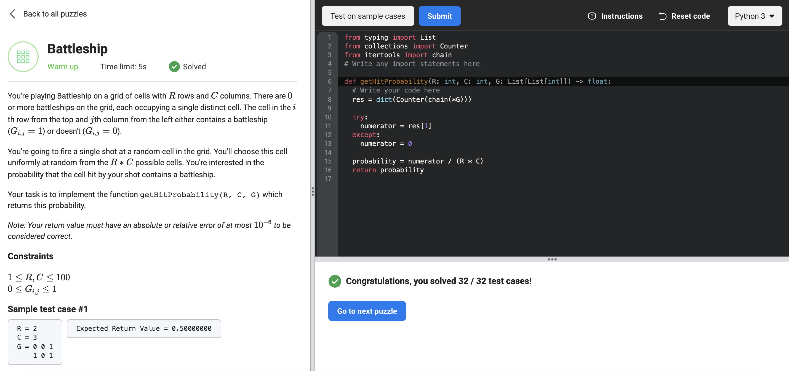

# Battleship

https://www.facebookrecruiting.com/portal/coding_puzzles/?puzzle=3641006936004915




```python
# Write any import statements here
from typing import List
from collections import Counter
from itertools import chain


def getHitProbability(R: int, C: int, G: List[List[int]]) -> float:
  # Write your code here
  res = dict(Counter(chain(*G)))
  
  try:
    numerator = res[1]
  except:
    numerator = 0
  
  probability = numerator / (R * C)
  return probability

```


