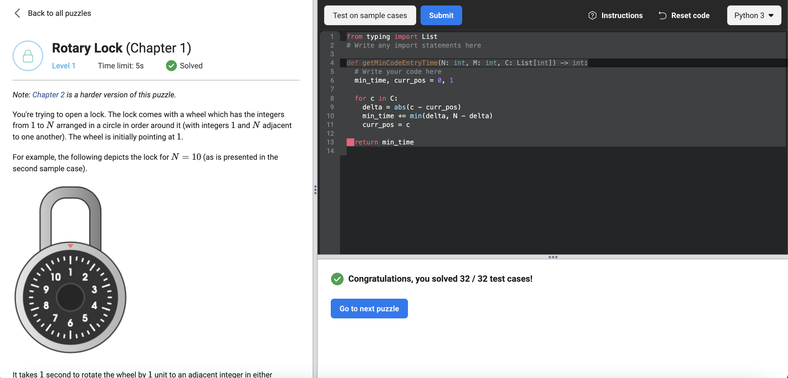

# [Rotary Lock](https://www.facebookrecruiting.com/portal/coding_puzzles/?puzzle=990060915068194)



```python
from typing import List
# Write any import statements here

def getMinCodeEntryTime(N: int, M: int, C: List[int]) -> int:
  # Write your code here
  min_time, curr_pos = 0, 1

  for c in C:
    delta = abs(c - curr_pos)
    min_time += min(delta, N - delta)
    curr_pos = c
 
  return min_time
```


