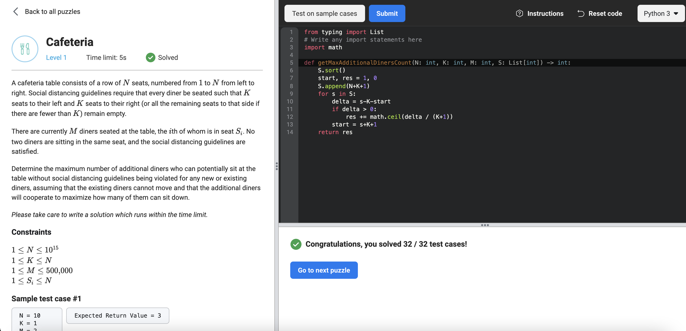

# [Cafeteria](https://www.facebookrecruiting.com/portal/coding_puzzles/?puzzle=203188678289677)



```python
from typing import List
# Write any import statements here
import math

def getMaxAdditionalDinersCount(N: int, K: int, M: int, S: List[int]) -> int:
    S.sort()
    start, res = 1, 0
    S.append(N+K+1)
    for s in S:
        delta = s-K-start
        if delta > 0: 
            res += math.ceil(delta / (K+1))
        start = s+K+1
    return res
```


