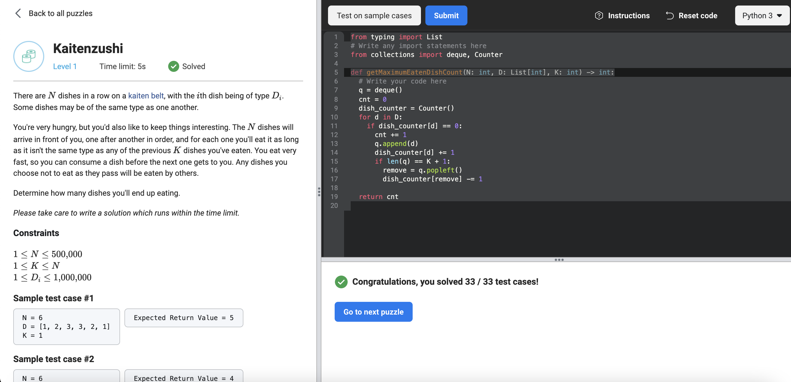

# [Kaitenzushi](https://www.facebookrecruiting.com/portal/coding_puzzles/?puzzle=958513514962507)



```python
from typing import List
# Write any import statements here
from collections import deque, Counter

def getMaximumEatenDishCount(N: int, D: List[int], K: int) -> int:
  # Write your code here
  q = deque()
  cnt = 0
  dish_counter = Counter()
  for d in D:
    if dish_counter[d] == 0:
      cnt += 1
      q.append(d)
      dish_counter[d] += 1
      if len(q) == K + 1:
        remove = q.popleft()
        dish_counter[remove] -= 1

  return cnt
```


