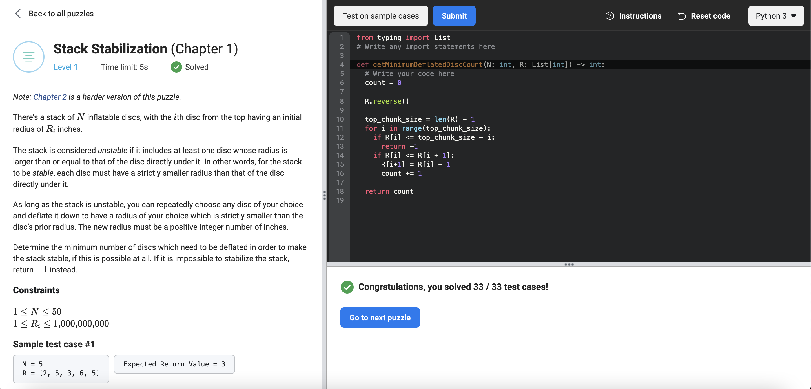

# [Stack Stabilization](https://www.facebookrecruiting.com/portal/coding_puzzles/?puzzle=183894130288005)



```python
from typing import List
# Write any import statements here

def getMinimumDeflatedDiscCount(N: int, R: List[int]) -> int:
  # Write your code here
  count = 0
  
  R.reverse()
  
  top_chunk_size = len(R) - 1
  for i in range(top_chunk_size):
    if R[i] <= top_chunk_size - i:
      return -1
    if R[i] <= R[i + 1]:
      R[i+1] = R[i] - 1
      count += 1
    
  return count
```


