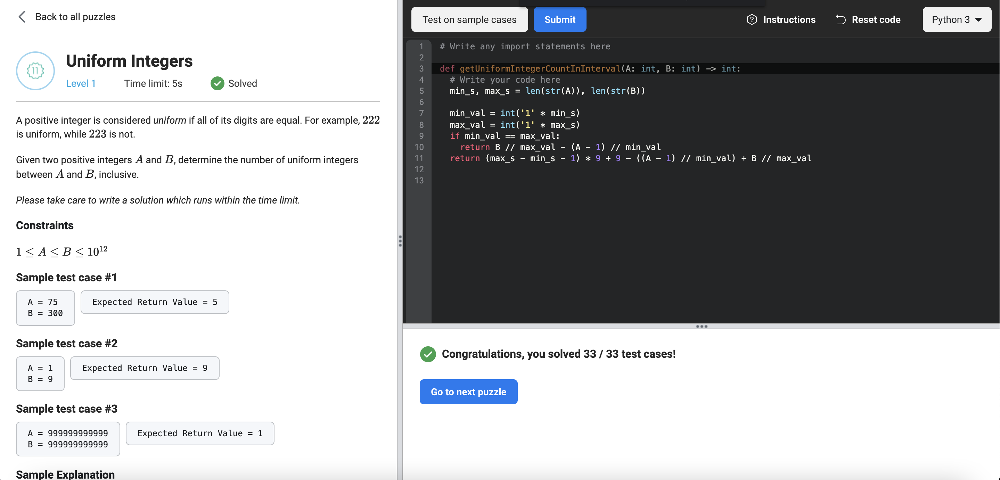

# [Uniform Integers](https://www.facebookrecruiting.com/portal/coding_puzzles/?puzzle=228269118726856)



```python
# Write any import statements here

def getUniformIntegerCountInInterval(A: int, B: int) -> int:
  # Write your code here
  cnt = 0
  start = min(A, B)
  end = max(A, B)
  
  init_uniforms_to_add = len(str(A))
  start_uniform = int(str(A)[0] * init_uniforms_to_add)
  start_uniform = str(start_uniform + int("1" * init_uniforms_to_add)) if start_uniform < start else str(start_uniform)
  
  end_uniforms_to_add = len(str(B))
  end_uniform = int(str(B)[0] * end_uniforms_to_add)
  end_uniform = str(end_uniform - int("1" * end_uniforms_to_add)) if end_uniform > end else str(end_uniform)
  
  in_between_cnt = (len(str(end)) - len(str(start)) - 1) * 9
  
  cnt += 10 - int(start_uniform[0])
  cnt += int(end_uniform[0])
  cnt += in_between_cnt

  return cnt
```

Another solution (more compact):

```python
# Write any import statements here

def getUniformIntegerCountInInterval(A: int, B: int) -> int:
  # Write your code here
  min_s, max_s = len(str(A)), len(str(B))

  min_val = int('1' * min_s)
  max_val = int('1' * max_s)
  if min_val == max_val:
    return B // max_val - (A - 1) // min_val
  return (max_s - min_s - 1) * 9 + 9 - ((A - 1) // min_val) + B // max_val
```


