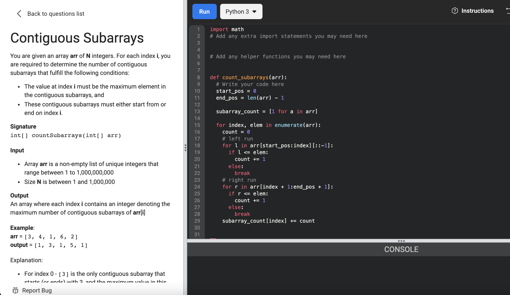

# [Contiguous Subarrays](https://www.facebookrecruiting.com/portal/coding_practice_question/?problem_id=226517205173943&c=508393084131712&ppid=454615229006519&practice_plan=1)



```python

# Naive Solution
def count_subarrays(arr):
  # Write your code here
  start_pos = 0
  end_pos = len(arr) - 1
  
  subarray_count = [1 for a in arr]
  
  for index, elem in enumerate(arr):
    count = 0
    # left run
    for l in arr[start_pos:index][::-1]:
      if l <= elem:
        count += 1
      else:
        break
    # right run
    for r in arr[index + 1:end_pos + 1]:
      if r <= elem:
        count += 1
      else:
        break    
    subarray_count[index] += count
    
   
  return subarray_count
  

# These are the tests we use to determine if the solution is correct.
# You can add your own at the bottom.

def printInteger(n):
  print('[', n, ']', sep='', end='')

def printIntegerList(array):
  size = len(array)
  print('[', end='')
  for i in range(size):
    if i != 0:
      print(', ', end='')
    print(array[i], end='')
  print(']', end='')

test_case_number = 1

def check(expected, output):
  global test_case_number
  expected_size = len(expected)
  output_size = len(output)
  result = True
  if expected_size != output_size:
    result = False
  for i in range(min(expected_size, output_size)):
    result &= (output[i] == expected[i])
  rightTick = '\u2713'
  wrongTick = '\u2717'
  if result:
    print(rightTick, 'Test #', test_case_number, sep='')
  else:
    print(wrongTick, 'Test #', test_case_number, ': Expected ', sep='', end='')
    printIntegerList(expected)
    print(' Your output: ', end='')
    printIntegerList(output)
    print()
  test_case_number += 1

if __name__ == "__main__":
  test_1 = [3, 4, 1, 6, 2]
  expected_1 = [1, 3, 1, 5, 1]
  output_1 = count_subarrays(test_1)
  check(expected_1, output_1)
  
  test_2 = [2, 4, 7, 1, 5, 3]
  expected_2 = [1, 2, 6, 1, 3, 1]
  output_2 = count_subarrays(test_2)
  check(expected_2, output_2)

  # Add your own test cases here
  
  
```


