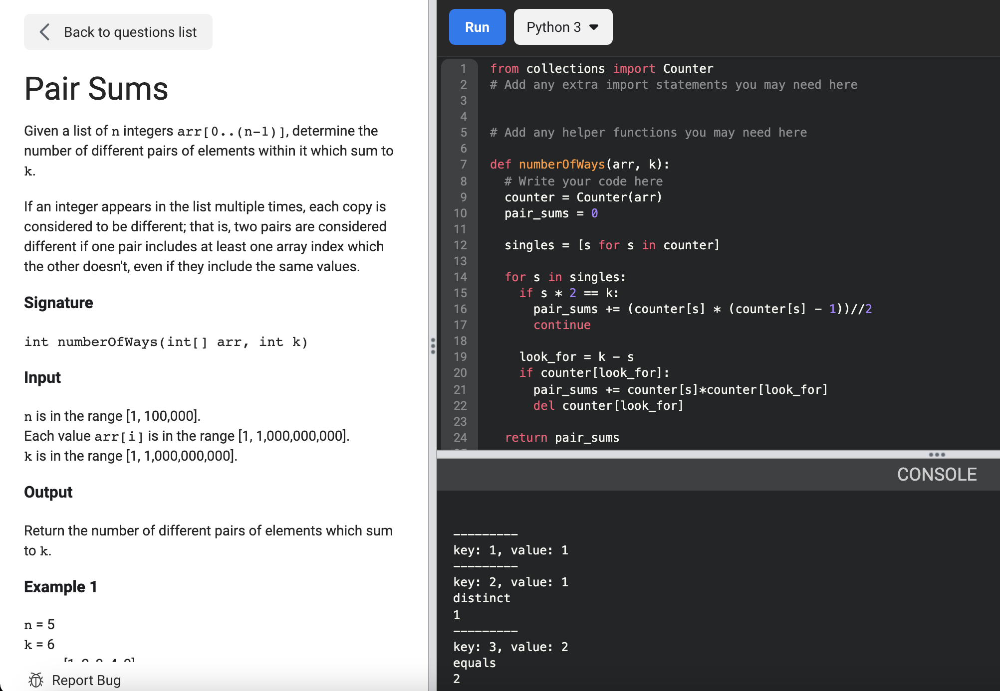

# [Pair Sums](https://www.facebookrecruiting.com/portal/coding_practice_question/?problem_id=840934449713537&c=508393084131712&ppid=454615229006519&practice_plan=1)



```python
from collections import Counter

def numberOfWays(arr, k):
  # Write your code here
  counter = Counter(arr)
  pair_sums = 0
  
  singles = [s for s in counter]
    
  for s in singles:
    if s * 2 == k:
      pair_sums += (counter[s] * (counter[s] - 1))//2
      continue
    
    look_for = k - s
    if counter[look_for]:
      pair_sums += counter[s]*counter[look_for]
      del counter[look_for]

  return pair_sums

# These are the tests we use to determine if the solution is correct.
# You can add your own at the bottom.

def printInteger(n):
  print('[', n, ']', sep='', end='')

test_case_number = 1

def check(expected, output):
  global test_case_number
  result = False
  if expected == output:
    result = True
  rightTick = '\u2713'
  wrongTick = '\u2717'
  if result:
    print(rightTick, 'Test #', test_case_number, sep='')
  else:
    print(wrongTick, 'Test #', test_case_number, ': Expected ', sep='', end='')
    printInteger(expected)
    print(' Your output: ', end='')
    printInteger(output)
    print()
  test_case_number += 1

if __name__ == "__main__":
  k_1 = 6
  arr_1 = [1, 2, 3, 4, 3]
  expected_1 = 2
  output_1 = numberOfWays(arr_1, k_1)
  check(expected_1, output_1)

  k_2 = 6
  arr_2 = [1, 5, 3, 3, 3]
  expected_2 = 4
  output_2 = numberOfWays(arr_2, k_2)
  check(expected_2, output_2)

  # Add your own test cases here
  
```


