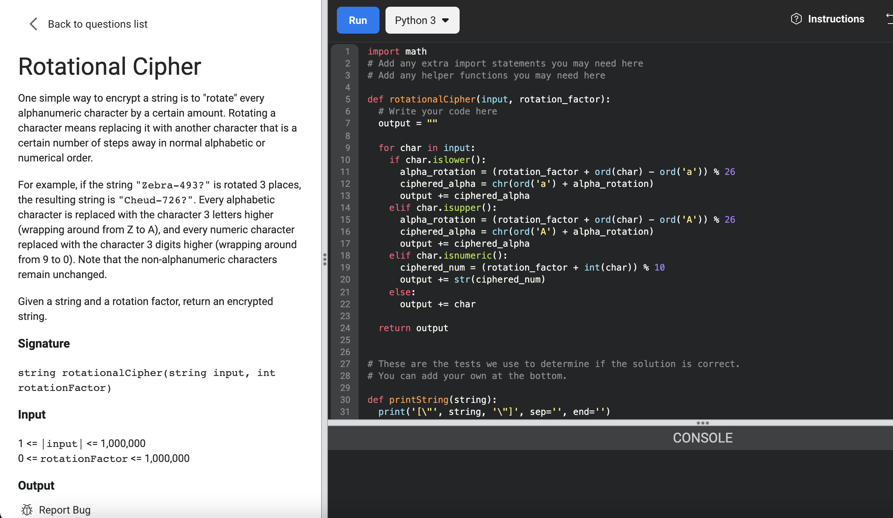

# [Rotational Cipher](https://www.facebookrecruiting.com/portal/coding_practice_question/?problem_id=238827593802550&c=508393084131712&ppid=454615229006519&practice_plan=1)



```python
import math
# Add any extra import statements you may need here
# Add any helper functions you may need here

def rotationalCipher(input, rotation_factor):
  # Write your code here
  output = ""

  for char in input:
    if char.islower():
      alpha_rotation = (rotation_factor + ord(char) - ord('a')) % 26
      ciphered_alpha = chr(ord('a') + alpha_rotation)
      output += ciphered_alpha
    elif char.isupper():
      alpha_rotation = (rotation_factor + ord(char) - ord('A')) % 26
      ciphered_alpha = chr(ord('A') + alpha_rotation)
      output += ciphered_alpha
    elif char.isnumeric():
      ciphered_num = (rotation_factor + int(char)) % 10
      output += str(ciphered_num)
    else:
      output += char
    
  return output


# These are the tests we use to determine if the solution is correct.
# You can add your own at the bottom.

def printString(string):
  print('[\"', string, '\"]', sep='', end='')

test_case_number = 1

def check(expected, output):
  global test_case_number
  result = False
  if expected == output:
    result = True
  rightTick = '\u2713'
  wrongTick = '\u2717'
  if result:
    print(rightTick, 'Test #', test_case_number, sep='')
  else:
    print(wrongTick, 'Test #', test_case_number, ': Expected ', sep='', end='')
    printString(expected)
    print(' Your output: ', end='')
    printString(output)
    print()
  test_case_number += 1

if __name__ == "__main__":
  input_1 = "All-convoYs-9-be:Alert1."
  rotation_factor_1 = 4
  expected_1 = "Epp-gsrzsCw-3-fi:Epivx5."
  output_1 = rotationalCipher(input_1, rotation_factor_1)
  check(expected_1, output_1)

  input_2 = "abcdZXYzxy-999.@"
  rotation_factor_2 = 200
  expected_2 = "stuvRPQrpq-999.@"
  output_2 = rotationalCipher(input_2, rotation_factor_2)
  check(expected_2, output_2)

  # Add your own test cases here
  
```


