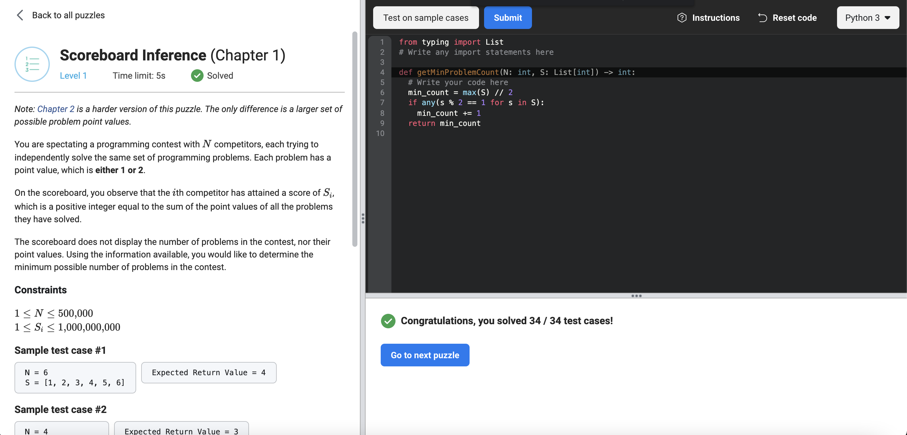

# [Scoreboard Inference](https://www.facebookrecruiting.com/portal/coding_puzzles/?puzzle=348371419980095)



```python
from typing import List
# Write any import statements here

def getMinProblemCount(N: int, S: List[int]) -> int:
  # Write your code here
  min_count = max(S) // 2
  if any(s % 2 == 1 for s in S): 
    min_count += 1
  return min_count 
```


